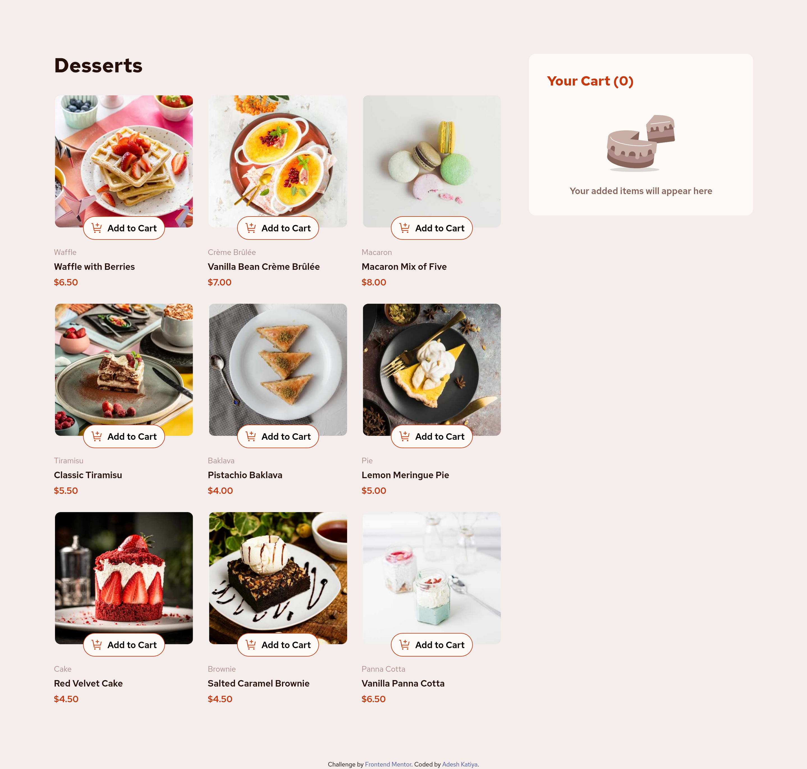

# Frontend Mentor - Product list with cart solution

This is a solution to the [Product list with cart challenge on Frontend Mentor](https://www.frontendmentor.io/challenges/product-list-with-cart-5MmqLVAp_d). Frontend Mentor challenges help you improve your coding skills by building realistic projects.

## Table of contents

- [Frontend Mentor - Product list with cart solution](#frontend-mentor---product-list-with-cart-solution)
    - [Table of contents](#table-of-contents)
    - [Overview](#overview)
        - [The challenge](#the-challenge)
        - [Screenshot](#screenshot)
        - [Links](#links)
    - [My process](#my-process)
        - [Built with](#built-with)
        - [What I learned](#what-i-learned)
        - [Useful resources](#useful-resources)

## Overview

### The challenge

Users should be able to:

- Add items to the cart and remove them
- Increase/decrease the number of items in the cart
- See an order confirmation modal when they click "Confirm Order"
- Reset their selections when they click "Start New Order"
- View the optimal layout for the interface depending on their device's screen size
- See hover and focus states for all interactive elements on the page

### Screenshot

### Links

- Solution URL: [Product List with Cart](https://www.frontendmentor.io/solutions/responsive-product-list-with-cart-using-react-19-tailwind-v4-and-vite-BAcVjMLaPH)
- Live Site URL: [Product List with Cart](https://fem-product-list-with-cart-xi.vercel.app/)

## My process

### Built with

- Semantic HTML5 markup
- CSS custom properties
- Flexbox
- CSS Grid
- Mobile-first workflow
- [React](https://reactjs.org/) - JS library
- [Vite](https://vite.dev/) - Build tool
- [Tailwind CSS](https://tailwindcss.com/) - For styles

### What I learned

- Learn about global/local state management with Context API, this was a good challenge to learn the use case.
- About creating modular code and extracting components out of primary ones.
- Adding custom styles in tailwind.

### Useful resources

- [React's Context API for state management](https://react.dev/learn/passing-data-deeply-with-context) - Docs for using a context for shared state.
- [Tailwind Docs](https://tailwindcss.com/docs/adding-custom-styles) - Docs for creating custom styles.
